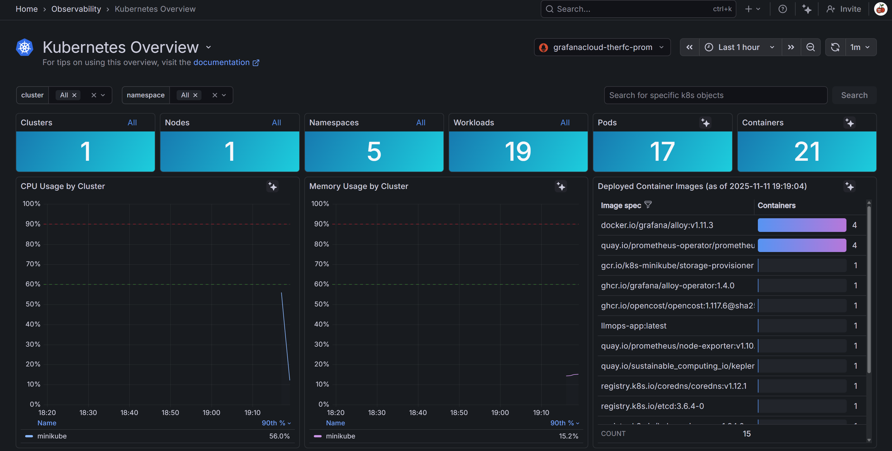
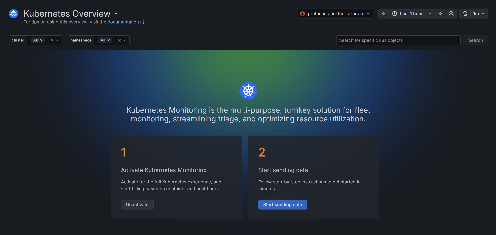
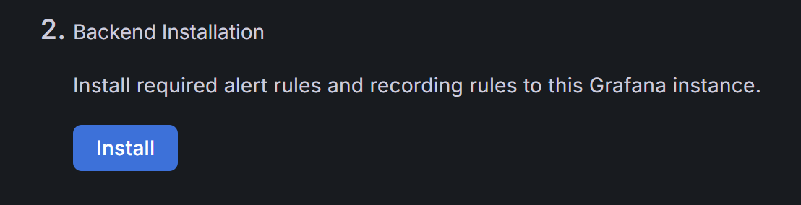
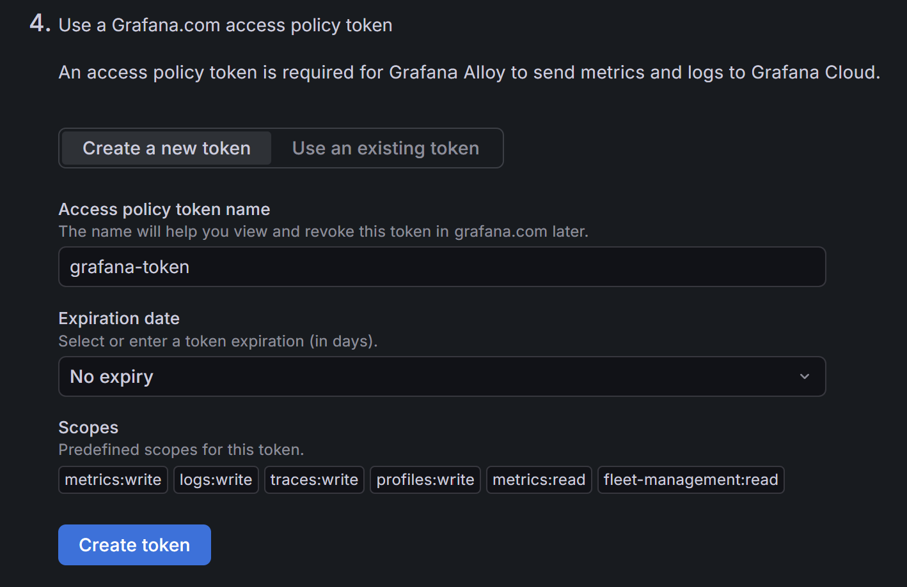
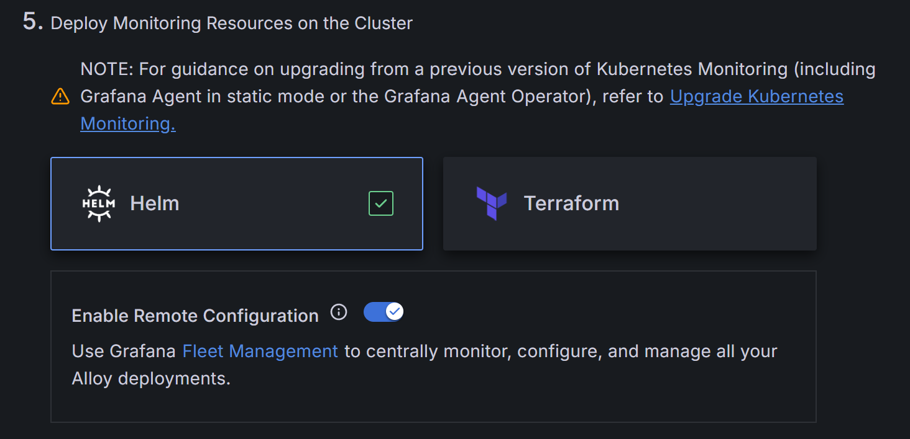

# 📊 **Grafana Cloud Monitoring — LLMOps Anime Recommender System**

This stage integrates **Grafana Cloud Monitoring** with the **LLMOps Anime Recommender System**, enabling **real-time observability** of your Kubernetes cluster and application performance.  
It provides complete visibility into **metrics**, **logs**, and **traces** through Grafana Cloud’s managed dashboards.

<p align="center">
  
</p>

## ☁️ **Overview**

In this stage, Grafana Cloud is configured to collect and display monitoring data from your local Kubernetes cluster (**Minikube**) using the **Grafana k8s-monitoring Helm chart**.  
This setup installs a suite of Grafana Alloy agents and exporters that gather metrics and logs from your cluster, feeding them securely into your Grafana Cloud workspace.

## 🧱 **1. Create a Monitoring Namespace**

Open a new VM terminal and create a dedicated namespace for monitoring:

```bash
kubectl create ns monitoring
````

Expected output:

```
namespace/monitoring created
```

Verify:

```bash
kubectl get ns
```

Output:

```
NAME              STATUS   AGE
default           Active   99m
kube-node-lease   Active   99m
kube-public       Active   99m
kube-system       Active   99m
monitoring        Active   43s
```

## 🪜 **2. Install Helm**

Visit [Helm Installation Guide](https://helm.sh/docs/intro/install/) and scroll to the **“From Script”** section.
Run the following commands **one at a time** in your terminal:

```bash
curl -fsSL -o get_helm.sh https://raw.githubusercontent.com/helm/helm/main/scripts/get-helm-3
chmod 700 get_helm.sh
./get_helm.sh
```

Output:

```
Downloading https://get.helm.sh/helm-v3.19.0-linux-amd64.tar.gz
Verifying checksum... Done.
Preparing to install helm into /usr/local/bin
helm installed into /usr/local/bin/helm
```

## 🧭 **3. Set Up Grafana Cloud**

1. Go to [Grafana Cloud](https://grafana.com/products/cloud/).
2. Sign up for an account (free-forever tier after 14-day trial).
3. Launch your Grafana Cloud dashboard.
4. In the left panel, go to **Observability → Kubernetes**.

<p align="center">
  
</p>

Click **Activate Kubernetes Monitoring**, then **Start sending data**.

<p align="center">
  
</p>

Scroll down and click **Install**.

<p align="center">
  
</p>

Enter:

* **Cluster name:** `minikube`
* **Namespace:** `monitoring`
* Ensure **Kubernetes** is selected.

Create a new token called **grafana-token** and copy it for later.

<p align="center">
  
</p>

## ⚙️ **4. Configure Helm for Grafana Monitoring**

Select **Helm** as the installation method.

<p align="center">
  
</p>

In your VM terminal, open a new file:

```bash
vi values.yaml
```

Copy the **deployment code** provided by Grafana into a notepad.
Cut the **first four lines** into a separate note and remove the `EOF` from the bottom of the script.
Paste the remaining code into your `values.yaml` file and save it.

Then edit the four lines you separated to look like this:

```bash
helm repo add grafana https://grafana.github.io/helm-charts &&
  helm repo update &&
  helm upgrade --install --atomic --timeout 300s grafana-k8s-monitoring grafana/k8s-monitoring \
    --namespace "monitoring" --create-namespace --values values.yaml
```

Run this command block in your terminal.

Expected output:

```
"grafana" has been added to your repositories
Hang tight while we grab the latest from your chart repositories...
...Successfully got an update from the "grafana" chart repository
Update Complete. ⎈Happy Helming!⎈
Release "grafana-k8s-monitoring" does not exist. Installing it now.
```

## 🚀 **5. Deployment Confirmation**

After a few minutes, you should see:

```
Release "grafana-k8s-monitoring" does not exist. Installing it now.
NAME: grafana-k8s-monitoring
LAST DEPLOYED: Tue Nov 11 19:14:07 2025
NAMESPACE: monitoring
STATUS: deployed
REVISION: 1
TEST SUITE: None
NOTES:
Grafana k8s-monitoring Helm chart deployed!
```

### Components Installed

* Grafana Alloy Operator
* kube-state-metrics (Deployment)
* Node Exporter (DaemonSet)
* Windows Exporter (DaemonSet)
* Kepler (DaemonSet)
* Grafana Alloy “alloy-metrics” (StatefulSet)
* Grafana Alloy “alloy-singleton” (Deployment)
* Grafana Alloy “alloy-logs” (DaemonSet)
* Grafana Alloy “alloy-receiver” (DaemonSet)

### Data Collection Overview

* Scrapes Kubernetes cluster metrics to **Grafana Cloud Metrics**
* Sends logs and events to **Grafana Cloud Logs**
* Sends telemetry traces via **OTLP gRPC / HTTP / Zipkin**

### Application Telemetry Endpoints

```
http://grafana-k8s-monitoring-alloy-receiver.monitoring.svc.cluster.local:4317  (OTLP gRPC)
http://grafana-k8s-monitoring-alloy-receiver.monitoring.svc.cluster.local:4318  (OTLP HTTP)
http://grafana-k8s-monitoring-alloy-receiver.monitoring.svc.cluster.local:9411  (Zipkin)
```

## 🔍 **6. Verify Deployment**

Check the pods:

```bash
kubectl get pods -n monitoring
```

Output:

```
NAME                                                         READY   STATUS    RESTARTS      AGE
grafana-k8s-monitoring-alloy-logs-b64zw                      2/2     Running   0             2m50s
grafana-k8s-monitoring-alloy-metrics-0                       2/2     Running   0             2m50s
grafana-k8s-monitoring-alloy-operator-7b4b7c74c-87d75        1/1     Running   0             3m8s
grafana-k8s-monitoring-alloy-receiver-gnbv6                  2/2     Running   0             2m50s
grafana-k8s-monitoring-alloy-singleton-f5f9d6976-rxq5r       2/2     Running   0             2m50s
grafana-k8s-monitoring-kepler-zhcqp                          1/1     Running   0             3m8s
grafana-k8s-monitoring-kube-state-metrics-85f4448db8-qcl8m   1/1     Running   0             3m8s
grafana-k8s-monitoring-node-exporter-fqchr                   1/1     Running   0             3m8s
grafana-k8s-monitoring-opencost-7d97d888fc-r8db9             1/1     Running   4 (86s ago)   3m8s
```

## 📈 **7. Access the Grafana Cloud Dashboard**

Return to Grafana Cloud.
Below where you copied your Helm deployment code, click **Go to homepage**.
This opens your pre-configured **Kubernetes Monitoring Dashboard**.

You should now be able to visualise your cluster’s performance, node health, resource utilisation, and log activity in real time.

<p align="center">
  
</p>

✅ **Grafana Cloud Monitoring successfully integrated with your LLMOps Anime Recommender System!**